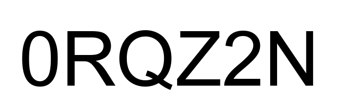
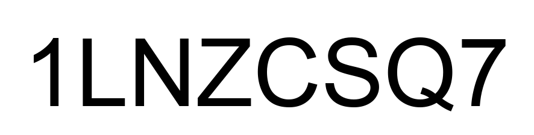
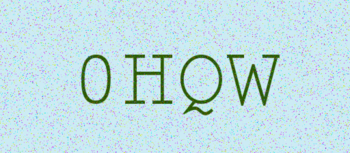
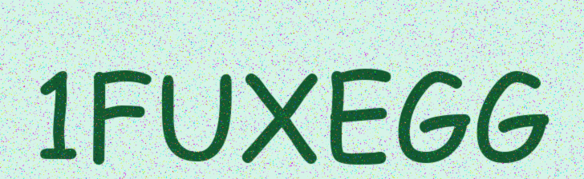
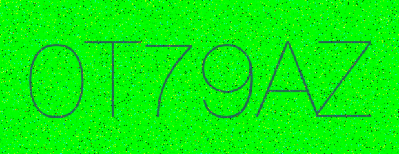
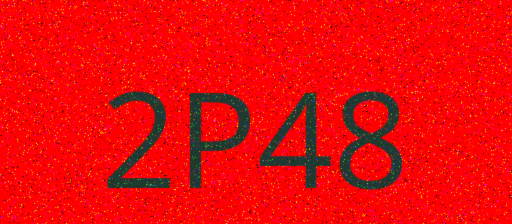

# NeuralCAPTCHA: A Deep Learning Framework for Optical Character Recognition

**NeuralCAPTCHA** is a robust computer vision pipeline designed to solve the problem of text extraction from noisy, distorted, and adversarial images (CAPTCHAs).  Moving beyond classical handcrafted features, this project implements a hybrid approach combining heuristic signal processing with a custom Convolutional Neural Network (CharNet) to achieve high-fidelity text recognition.

---

## NOTE: Some of the mathematical notation does not render properly in GitHub's display of README.md. Please clone this repository and preview the README with any modern IDE like VSCode.

---

## 1. Problem Formulation

We define the CAPTCHA breaking task as a mapping function $\Phi: \mathcal{I} \to \mathcal{S}^*$, where $\mathcal{I} \subseteq \mathbb{R}^{H \times W \times C}$ represents the image space and $\mathcal{S}^*$ represents the set of all possible finite strings over a vocabulary $\Sigma$ (alphanumeric characters).

The project addresses three distinct levels of complexity defined in the task specifications:
1.  **Task 1 (Classification):** Learning a mapping $f: \mathcal{I} \to Y$ where $Y \subset \mathcal{S}^*$ is a closed set of 100 labels.
2.  **Task 2 (Generation):** Learning a generalized mapping for variable-length sequences where $S_{out} = \{c_1, c_2, \dots, c_n\}$.
3.  **Task 3 (Adversarial/Bonus):** Handling conditional transformations $T_{cond}$ based on latent image properties, specifically color channel dominance.

---

## 2. Mathematical Framework

### 2.1 Synthetic Data Generation (The Prior Distribution)
 To train $\Phi$, we approximate the true data distribution $P_{data}(x, y)$ by synthesizing a dataset $\mathcal{D} = \{(x^{(i)}, y^{(i)})\}_{i=1}^N$ using a generative process $G$.

For an image $x$, the generator applies a set of stochastic transformations:
$$x = \mathcal{N}(\mathcal{B}(\mathcal{F}(y; \theta_{font}); \theta_{bg})); \sigma$$

Where:
*  $\mathcal{F}$ renders text $y$ with font parameters $\theta_{font}$, handling variable fonts and capitalizations.
*  $\mathcal{B}$ applies background textures and colors $\theta_{bg}$.
* $\mathcal{N}$ injects additive noise $\eta \sim \mathcal{U}(0, \epsilon)$ and Gaussian blurring $G_\sigma$.

### 2.2 Signal Processing Pipeline

Before neural inference, input $x$ undergoes a rigorous preprocessing pipeline to maximize the Signal-to-Noise Ratio (SNR).

#### 2.2.1 Binarization via Inter-Class Variance Maximization
We utilize Otsu's method to determine the optimal global threshold $t^*$ that separates foreground (text) from background. We maximize the inter-class variance $\sigma_B^2(t)$:
$$t^* = \operatorname*{arg\,max}_{0 \le t \le L-1} [\omega_0(t) \omega_1(t) (\mu_0(t) - \mu_1(t))^2]$$

#### 2.2.2 Segmentation via Shear-Corrected Projection
To resolve character overlap caused by italicized fonts, we introduce a shear transformation matrix $M_\lambda$:

$$
M_\lambda = \begin{bmatrix} 1 & \lambda \\ 0 & 1 \end{bmatrix}
$$

We define the Vertical Projection Profile $V_\lambda(x)$ of the sheared image $I' = M_\lambda I$. The optimal shear $\lambda^*$ is found by maximizing the variance of the derivative of the projection (a sharpness heuristic):

$$
\lambda^* = \underset{\lambda}{\mathrm{arg\,max}} \sum_x \left( \frac{d}{dx} V_\lambda(x) \right)^2
$$

This creates distinct "valleys" in the histogram, allowing for effective character segmentation $S=\{s_1, s_2, \dots, s_n\}$.

### 2.3 Neural Architecture: CharNet

The core recognizer is a Convolutional Neural Network $f_\theta$ designed to classify individual character segments $s_i \in \mathbb{R}^{32 \times 32}$.

**Architecture Definition:**
* **Input:** $X_0 \in \mathbb{R}^{32 \times 32 \times 1}$
* **Feature Extraction:** Three blocks of Convolution ($W * X$), Batch Normalization, and Rectified Linear Units ($\sigma(z) = \max(0, z)$).
* **Dimensionality Reduction:** Max Pooling operations to enforce translation invariance.
    $$y_{i,j} = \max_{(p,q) \in \Omega_{i,j}} x_{p,q}$$
* **Classification:** A fully connected head mapping flattened features to logits $z \in \mathbb{R}^{62}$ (for 62 alphanumeric classes).
* **Objective:** We minimize the Cross-Entropy Loss via Adam optimization:
    $$\mathcal{L}(\theta) = -\frac{1}{N} \sum_{i=1}^N \sum_{c=1}^{C} y_{i,c} \log(\hat{y}_{i,c})$$

---

## 3. Bonus Task: Conditional Logic Gates

The Bonus Task introduces a logical XOR gate dependent on spectral properties.  As defined in the task requirements, the text is rendered in reverse if the background is red. We compute the mean intensity vectors for the Red ($\mu_R$) and Green ($\mu_G$) channels.

The transformation function $T(S)$ is defined as:
$$
T(S) = 
\begin{cases} 
\text{Reverse}(S) & \text{if } \mu_R > (\mu_G + \delta) \\
S & \text{otherwise}
\end{cases}
$$

 This requires the inference pipeline to first classify spectral dominance, predict the sequence, and conditionally invert the string result to solve the generation task.

---

## 4. Performance & Results

The model was evaluated on a held-out validation set generated via the same stochastic process as the training set.

| Task | Metric | Performance |
| :--- | :--- | :--- |
| **Task 1 (Easy)** | Character Accuracy | **90.35%** |
| **Task 1 (Hard)** | Character Accuracy | **94.06%** |
| **Task 2 (Variable)** | Exact Match Accuracy | **100.00%** |
| **Task 3 (Bonus)** | Conditional Logic Accuracy | **100.00%** |

 *Note: The model demonstrates robust generalization to unseen fonts and noise levels, effectively solving the "Hard" dataset constraints described in the dataset specifications.*

---

## 5. Usage

**1. Environment Setup:**
```bash
pip install torch torchvision opencv-python numpy matplotlib wonderwords tqdm torchinfo
```

**2. Dataset Generation:**
Run the generation cells in the notebook to synthesize the Easy, Hard, and Bonus datasets as per Task 0 requirements.

**3. Training:**
Execute the training loop. The model implements an automatic ReduceLROnPlateau scheduler and saves the weights with the highest validation accuracy.

**4. Inference:**
To test on the provided task datasets:
```python
predict_bonus_captcha(model, "path/to/image.png", device)
```

## 6. Dataset Samples:

| Category | Sample 1 | Sample 2 |
| :---: | :---: | :---: |
| **Easy** |  |  |
| **Hard** |  |  |
| **Bonus** |  |  |